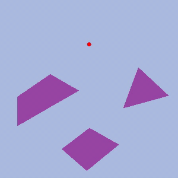
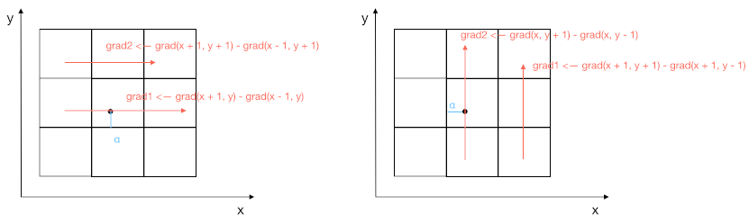

# sdf2d

Create 2D signed distance field (SDF) using points and polygons.

The accuracy is higher than that of [8ssedt](https://github.com/Lisapple/8SSEDT) method.

Inspired by Yuanming Hu's [Taichi](https://github.com/yuanming-hu/taichi).

# Computing gradient

When computing the gradient for a given point,
I use Yuanming Hu's strategy because it performs more smoothly than mine.

The final gradient is `grad = lerp(grad1, grad2, α)` for `x` and `y` direction, respectively.

It means, if the point is close to the left (or bottom) border of the current cell, i.e. `α -> 1`,
we get more gradient of the current cell.
Otherwise, we get more gradient of the `x + 1` (or `y + 1`) cell.

# Reducing computing time

When deal with dynamic objects in a simulating program,
recomputing SDF is necessary.
In this project, I used an expensive one.
But I have refined it in [another project](https://github.com/iamyoukou/sdf2dWithMPM2D).
